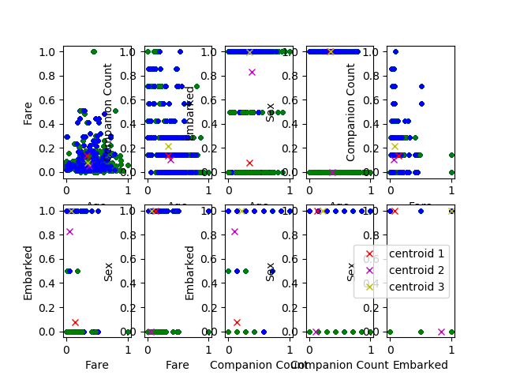

# Python-Projects

Hi there, this is Layla. Nice to meet you :) 

I post some of the projects that I have done with python on this page, hope you enjoy it.

Please feel free to comment, hope to communicate with all of you. 

## Titanic

**_Description_**

  The Titanic project develops algorithms to perform K-Means clustering on the Titanic passengers dataset in python. The Titanic passengers dataset includes five attributes (Fare, Age, Sex, Companion Count, Embarked) to describe each passenger and one target value ( Survive / Not Survive), the K-Means clustering aims to explore the relationship between the attributes and the survival by plotting one to one comparison.
  

After 6 iteration, the clustering is fixed, the plot below shows the outcome of the clustering by one to one comparsion of the attributes. 

**_Conclusion_**

  - People with low fare are survived more that people with high fare;

  - People with fewer companion are survived more than people with more companion;
  
  - With the high companion group, young people survived more than older people;
  
  - People who are at the S and C embarked location are survived more than people at Q location;
  
  - More female survived than male; With the survived male, the portion of young people is bigger than that of older people; the portion of low companion count is smaller than that with high companion count.

**_Notes_**

  There are 179 missing values in the original dataset, which takes a considerably big part of the dataset. The method that I chose to deal with the missing value is to delete them. however, after deleting the missing value, the outcome will be affected in some way. For example, the not survived people contributes majority of the missing value, so the outcome will be biased towards the survived people. And the proportion of survived people is higher than the actual proportion.
