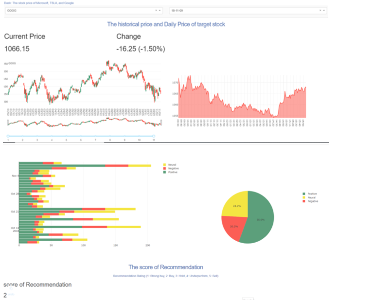

# Python-Projects

Hi there, this is Layla. Nice to meet you :) 

I post some of the projects that I have done with python on this page, hope you enjoy it.

Please feel free to comment, hope to communicate with all of you. 

## Titanic

**_Description_**

  The Titanic project develops algorithms to perform K-Means clustering on the Titanic passengers dataset in python. The Titanic passengers dataset includes five attributes (Fare, Age, Sex, Companion Count, Embarked) to describe each passenger and one target value ( Survive / Not Survive), the K-Means clustering aims to explore the relationship between the attributes and the survival by plotting one to one comparison.
  

After 6 iteration, the clustering is fixed, the plot below shows the outcome of the clustering by one to one comparsion of the attributes. 

**_Conclusion_**

  - People with low fare are survived more that people with high fare;

  - People with fewer companion are survived more than people with more companion;
  
  - With the high companion group, young people survived more than older people;
  
  - People who are at the S and C embarked location are survived more than people at Q location;
  
  - More female survived than male; for the survived male, the portion of young people is bigger than that of older people; the portion of low companion count is smaller than that of high companion count.

-Blue represents **Survived**

-Green represents **Not Survived**

**_Notes_**

  There are 179 missing values in the original dataset, which takes a considerably big part of the dataset. The method that I chose to deal with the missing value is to delete them. however, after deleting the missing value, the outcome will be affected in some way. For example, the not survived people contributes majority of the missing value, so the outcome will be biased towards the survived people. And the proportion of survived people is higher than the actual proportion.
  
  
## Stock Price Dashboard

**_Description_**

This project aims to create a real-time updating dashboard to show the variation of stock prices in certain period and to predict stock prices based on historical data; also use **NLP(natural language processing)** to perform sentiment analyses regarding the news related to the companies.

Three representative and successful technology companies are selected for this project - Google, Microsoft and Tsla.

  **Database** - There are 3 databases in total - _stock.db, new_stock3.db_, and _recommend.db_ 
  schedule is used to make it run automatically to collect daily stock price every two minute.

  **NLP** - _MSFT.py, TSLA.py_ and _GOOGLE.py_ perform sentiment analylsis by scrawling five most relevant news online and labeling   every sentences with neutral, positive or negative.
  
  **Predict** - _Predict_Stock_Price.py_ is to predict the change of stock price with **Support Vector Regression**
  
  **Recommand Score** - _Recommend_Score.py_ is to calculate and display the score of recommandation for buying, holding or selling selected company's stocks.

  **Dashborad** -  _dashboard_new.py_ creates the final dashboard which is comprised by current stock price, historical stock price, sentiment analysis and recommendation score.
  
  

